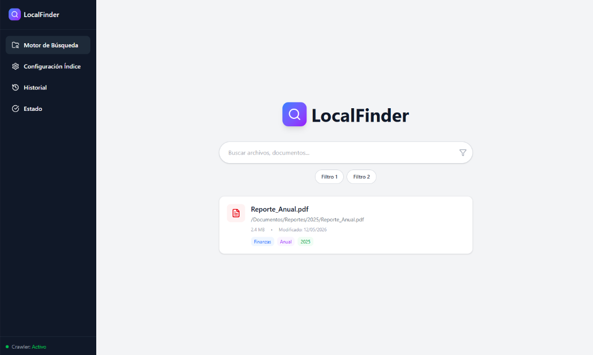
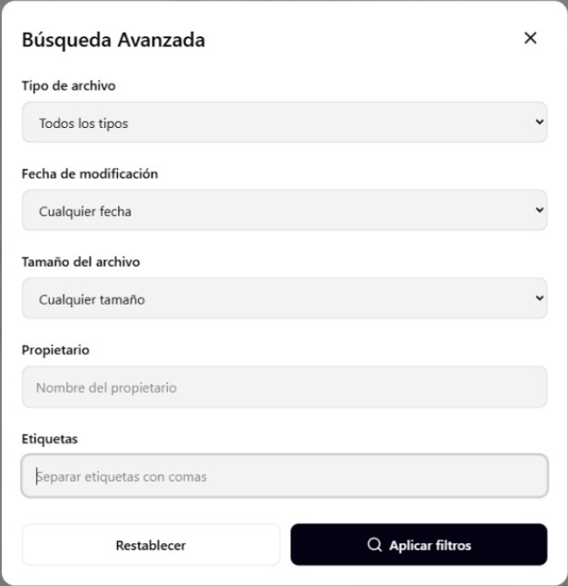
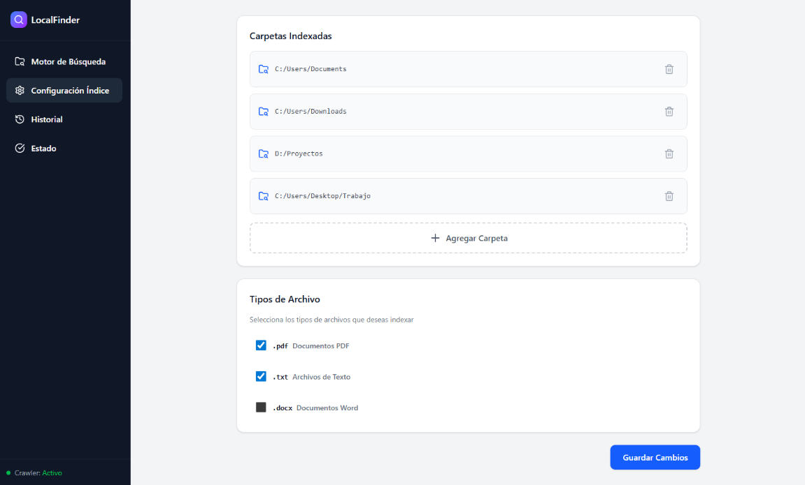
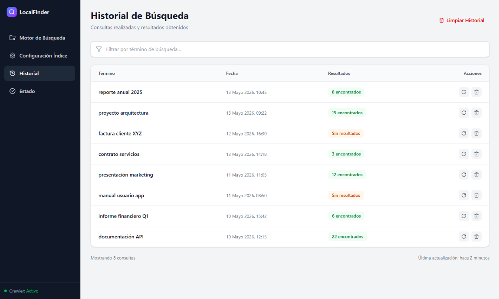
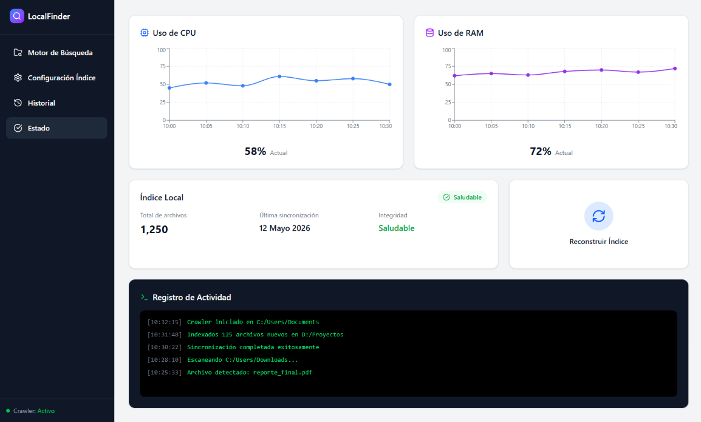

# LocalFinder

LocalFinder es un motor de búsqueda interno offline diseñado para indexar, organizar y recuperar información almacenada localmente de manera rápida, eficiente y segura.

Este proyecto nace para resolver las deficiencias de los buscadores nativos del sistema operativo (alta latencia, baja precisión y alto consumo de recursos), ofreciendo una herramienta enfocada en la productividad de estudiantes, investigadores y desarrolladores.

---

## Características Principales

* **Búsqueda por Contenido Profundo:** Indexación y recuperación de texto dentro de archivos PDF, DOCX y TXT.
* **Privacidad Total (Offline):** Funcionamiento completamente autónomo sin dependencia de servicios externos ni telemetría; ningún dato sale de tu equipo.
* **Velocidad Extrema:** Arquitectura optimizada para mantener tiempos de respuesta inferiores a 2 segundos en grandes volúmenes de documentos.
* **Indexación Selectiva:** Tú decides qué directorios se escanean, evitando el indexado innecesario de todo el disco duro.
* **Multiplataforma:** Compatible de forma nativa con entornos Windows y Linux.

---

## Stack Tecnológico

El sistema está construido bajo una arquitectura modular de 4 capas lógicas (Presentación, Negocio, Datos y Persistencia) empleando el patrón MVC.

* **Lenguaje:** Java 21 LTS
* **Interfaz Gráfica:** JavaFX (UI moderna sin necesidad de servidor local)
* **Motor de Búsqueda:** Apache Lucene (Índice invertido y algoritmo TF-IDF)
* **Extracción de Texto:** Apache Tika (Soporte uniforme para múltiples formatos)
* **Base de Datos:** SQLite (Embebida, con patrón DAO y JDBC)
* **Gestor de Dependencias:** Maven

---

# Casos de Uso Implementados

## CU01 - Buscar Archivos
Actor: Usuario

Permite realizar búsquedas sobre documentos previamente indexados por el sistema.

---

## CU02 - Ver Resultados de Búsqueda
Actor: Usuario

Permite visualizar los documentos encontrados junto con información relevante como nombre, ruta y fecha.

---

## CU03 - Filtrar Resultados
Actor: Usuario

Permite restringir los resultados mediante criterios específicos.

---

## CU04 - Ver Contenido del Archivo
Actor: Usuario

Permite visualizar información asociada al documento encontrado.

---

## CU05 - Gestionar Índice
Actor: Administrador

Permite administrar el índice de búsqueda utilizado por Apache Lucene.

---

## CU06 - Ejecutar Crawler
Actor: Administrador

Permite iniciar el proceso de exploración e identificación de archivos dentro de los directorios configurados.

---

## CU07 - Actualizar Repositorio de Archivos
Actor: Administrador

Permite sincronizar los documentos almacenados con el índice del sistema.

---

## Estado Actual de la Interfaz (UI)

Actualmente se encuentra implementada una primera versión funcional de la capa de presentación utilizando JavaFX. Esta versión incluye navegación entre módulos, motor de búsqueda, configuración, historial y panel de estado, los cuales serán integrados progresivamente con la lógica de negocio y el motor de búsqueda basado en Apache Lucene.

A continuación se detallan las vistas planificadas:

### 1. Vista Principal: Motor de Búsqueda
Interfaz centralizada estilo Google con resultados presentados en tarjetas dinámicas (nombre, ruta, fecha y un fragmento de contexto del texto encontrado).



### 2. Búsqueda Avanzada
Modal integrado sobre la vista principal que permite aplicar filtros en tiempo real: tipo de archivo, rango de fechas de modificación, tamaño y propietario.



### 3. Configuración del Índice
Panel administrativo para agregar o excluir rutas locales específicas usando el explorador nativo del SO, permitiendo pausar rastreos sin perder configuraciones.



### 4. Historial de Búsquedas
Tabla de control de productividad que registra localmente los términos buscados y métricas de resultados, con opciones para recargar búsquedas o limpiar registros.



### 5. Panel de Estado del Sistema
Dashboard de monitoreo técnico (exclusivo para usuarios avanzados) con métricas en tiempo real de CPU/RAM, salud de la base de datos y logs de la actividad del crawler.



---

## Instalación y Compilación (Desarrollo)

Asegúrate de tener instalado **JDK 21** y **Maven** en tu entorno local.

1. Clona este repositorio.
2. Navega al directorio raíz del proyecto donde se encuentra el `pom.xml`.
3. Compila el proyecto y descarga las dependencias ejecutando:
   ```bash
   mvn clean install